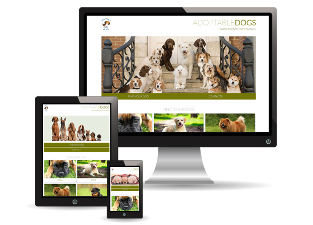

# Portfolio Site of Adoptable Dogs
[Demo](https://tbm85.github.io/Demo-Portfolio-Site/)

## Description
This portfolio website is a customization of the design mockup provided by Udacity to carry out this first project. It is a responsive web design built with HTML, CSS and Bootstrap.

## Resources
* [Udacity Design Mockup](https://storage.googleapis.com/supplemental_media/udacityu/2655898586/design-mockup-portfolio.pdf)
* [Bootstrap v3.3.7](https://getbootstrap.com/docs/3.3/)
* [Lato Font](https://fonts.googleapis.com/css?family=Lato:100,300)

## License
Copyright (c) 2018 Tania Ballester Marsal. This project is using [MIT License](LICENSE.md)